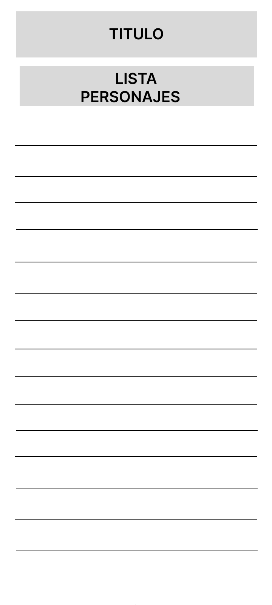
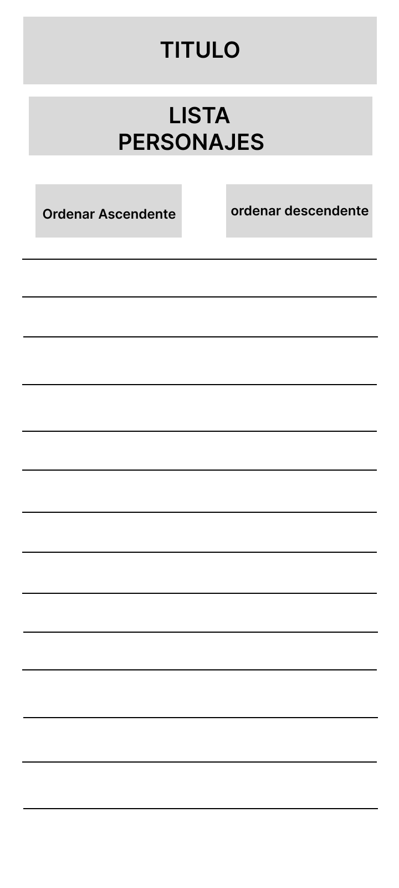
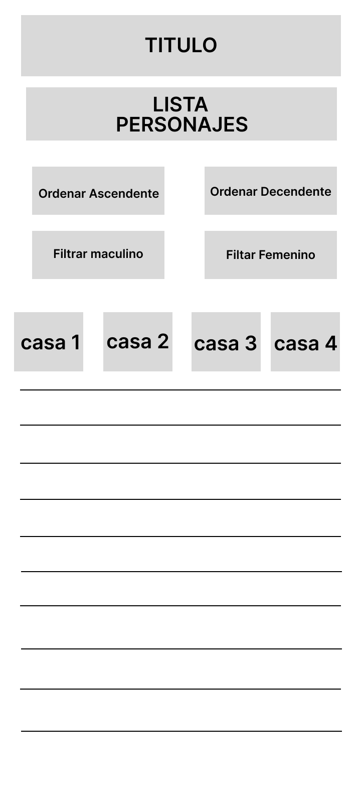
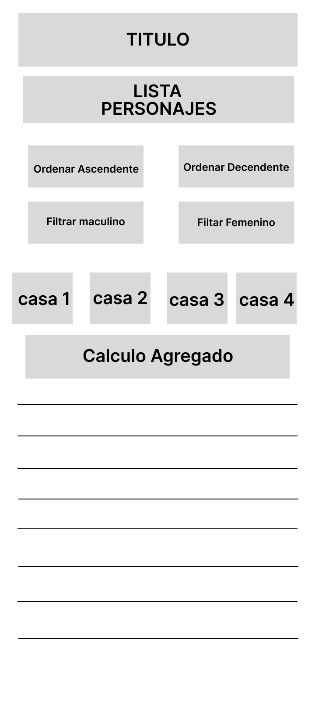
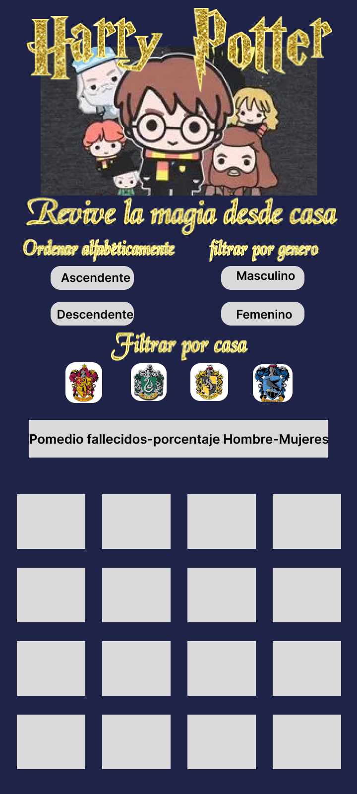

# Data Lovers Harry Potter

## Índice

* [1. Preámbulo](#1-preámbulo)
* [2. Resumen del proyecto](#2-resumen-del-proyecto)
* [3. Definición del producto](#3-definición-del-producto)
* [4. Relación del usuario con el producto ](#4-relación-del-usuario-con-el-producto)
* [5. Historias de usuario](#5-historia-de-usuarios)
* [6. Diseño de la Interfaz de Usuario](#6-diseño-de-la-interfaz-de-usuario)
* [7. Testeos de usabilidad](#7-testeos-de-usabilidad)
* [8. Implementación de la Interfaz de Usuario (HTML/CSS/JS)](#8-implementación-de-la-interfaz-de-usuario)
* [9. Pruebas unitarias](#9-pruebas-unitarias)
* [10.Consideraciones técnicas del proyecto](#10-consideraciones-tecnicas-del-proyecto)
* [11.Diseño de experiencia de usuario (User Experience Design)](#11-diseño-de-experiencia-de-usuario-(user-experiencia-desing))
* [12.Objetivos de aprendizaje](#12-objetivos-de-aprendizaje)
* [13.Herramientas](#13-herramientas)

***

## 1. Preámbulo

***

## 2. Resumen del proyecto

En este proyecto se construyo una _página web_ para usuarios fanaticos de Harry Potter, la cual nos permite visualizar un 
conjunto de datos que se adecúe a lo que nuestro usuario necesita.

Esta  página web permite **visualizar la data, filtrarla, ordenarla y hacer algún cálculo agregado**. 
Como el promedio de personajes fallecidos.

El objetivo principal de este proyecto es diseñar y construir una interfaz web donde se pueda visualizar y manipular data, 
entendiendo lo que el usuario necesita.

***
## 3. Definición del producto

***

## 4. Relación del usuario con el producto 

* ¿Como el producto resuelve el problema que tienen los usuarios?

Resuelve el problema dandoles información que ellos quieren ver o saber sobre sus personajes favoritos, y permitiendoles intereactuar con dicha información.

* ¿Quiénes son los principales usuarios de producto?

Los principales usuarios del producto son fanaticos de la saga Harry Potter.

* ¿Cuáles son los objetivos de estos usuarios en relación con el producto?

Poder ver y manipular informacion de sus personajes favoritos, objetivo saber más de sus personajes y entretención.

* ¿Cuáles son los datos más relevantes que quieren ver en la interfaz y por qué?

Inforación sobre los personajes, a que casa pertenecen, sexo etc, además de ver cuantos personajes fallecidos hay en la saga.

* ¿Cuándo utilizan o utilizarían el producto?

En sus tiempos libres, a modo de entretenimiento.

***
## 5. Historias de usuario  

**Historia de Usuario 1**

- **Yo como:** Fánatico de Harry Potter.

- **Quiero:** Ver los nombres de todos los personajes.

- **Para:** Actualizar mis conocimientos y recordar a cada uno de ellos.

- **Criterios de aceptación:**
1. La página debe mostrar todos los nombres de los personajes en pantalla.  
2. La página debe ser responsive, es decir que se adapte a cualquier dispositivo

- **Definición de terminado:**  

✅  La página deben mostrarse todos los nombres de los personajes

✅  La página esta publicada en Github Pages  

✅  Todo el código debe estar en la rama main del repositorio  

- **Prototipo de baja fidelidad Historia de Usuario 1**

***
**Historia de Usuario 2**

- **Yo como:** Fánatico de Harry Potter.

- **Quiero:** Poder interactuar con la información y ver los nombres ordenados alfabéticamente.

- **Para:** Ver cuales nombre empiezan con la letra A y cuales con la letra Z y así poder ampliar mis conocimientos sobre mis personajes favoritos.  

- **Criterios de aceptación:**
1. La pagina debe contar con un boton de ordenar (nombres de los persoajes alfabéticamente) Ascendente.
2. La pagina debe contar con un boton de ordenar (nombres de los persoajes alfabéticamente) Descendente.
3. Al hacer click en los botones debe ordenar los nombres de la A a la Z o viceversa según sea el caso.
4. Ser responsive, es decir que se adapte a cualquier dispositivo.  

- **Definición de terminado:**  

✅  Pasar los test unitarios

✅  La página esta publicada en Github pages

✅  Todo el código debe estar en la rama main del repositorio

- **Prototipo de baja fidelidad Historia de Usuario 2**

***
**Historia de Usuario 3**

- **Yo como:** Fánatico de Harry Potter.

- **Quiero:** Poder separar mis personajes por casa y por genero masculino y femenino.

- **Para:** Saber a que casa pertecene cada personaje y ver cuales son hombres y cuales mujeres.  

- **Criterios de aceptación:**
1. La página debe contar con 1 boton de filtrado por genero Masculino.
2. La página debe contar con 1 boton de filtrado por genero Femenino.
3. La página debe contar con 1 boton de filtrado por casa Gryffindor.
4. La página debe contar con 1 boton de filtrado por casa Hufflepuff.
5. La página debe contar con 1 boton de filtrado por casa Ravenclaw.
6. La página debe contar con 1 boton de filtrado por casa Slytherin.
7. Al hacer click en los botones debe mostrar los nombres de los personajes según su función
8. La página debe ser responsive, es decir que se adapte a cualquier dispositivo.  

- **Definición de terminado:**  
   

✅ Pasar los test unitarios  

✅ La página esta publicada en Github Pages  

✅ Todo el código debe estar en la rama main del repositorio  

- **Prototipo de baja fidelidad Historia de Usuario 3**

***

**Historia de Usuario 4**

- **Yo como:** Fánatico de Harry Potter

- **Quiero:** Poder ver el promedio de personajes fallecidos

- **Para:** Saber cuantos personajes mueren durante el transcurso de la historia

- **Criterios de aceptación:**
1. La página debe contar con un boton  de promedio personajes fallecidos.
2. Al hacer clic en el boton de promedio personas fallecidos debe ostrar coo resultado dicho promedio

- **Definición de terminado:**  

✅  Pasar los test unitarios

✅  La página esta publicada en Github Pages

✅  Todo el código debe estar en la rama main del repositorio

- **Prototipo de baja fidelidad Historia de Usuario 4**

***
## 6. Diseño de la Interfaz de Usuario

- **Prototipo de baja fidelidad**

bocetos (_sketches_) de tu solución usando papel y lápiz. 

- **Prototipo de alta fidelidad**

Prototipo Figma

***
## 7. Testeos de usabilidad

Durante el proyecto se realizaron  _tests_ de usabilidad con distintos usuarios, y
en base a los resultados, tuvimos que iterar los diseños. 

Los problemas de usabilidad detectados a través de los _tests_ fueron que los usuarios querian ver una pagina más interactiva, ya que solo teniamos a los personajes en formato de lista y ellos querian ver algo más interactivo, más atractivo, más entretenido.

Cómo mejoramos en nuestra propuesta final, tuvimos que mejorar nuestro  prototipo en donde los personajes se muestren en formato Card (tarjeta) y no como una simple lista, para así hacerlo más atractivo a la vista de nuestros usuarios.

***
## 8. Implementación de la Interfaz de Usuario (HTML/CSS/JS)

1. Mostrar la data en una interfaz en formato ser un card.
2. Permite al usuario interactuar para obtener la infomación que necesita.
3. Es _Responsive_, es decir, se puede  visualizar sin problemas desde distintos
   tamaños de pantallas: móviles, tablets y desktops.
4. Se siguieron los fundamentos de _visual design_.

***
## 9. Pruebas unitarias

Se escribieron Pruebas Unitarias (_tests_), para las funciones encargadas de  _procesar_,
_filtrar_ y _ordenar_ la data, así como _calculo_ agregado.

***
## 10. Consideraciones técnicas del proyecto

La lógica del proyecto esta implementada completamente en JavaScript
(ES6), HTML y CSS. En este proyecto no usamos librerías o
frameworks.

### `src/index.html`

En el archivo `index.html`. Va la página que se mostrará al usuario. También nos sirvio para indicar
qué scripts se usarán y unir todo lo que hicimos.

### `src/main.js`

En el archivo `src/main.js` esta todo el código que tiene que ver con
mostrar los datos en la pantalla. Con esto nos referimos básicamente a la
interacción con el DOM. Operaciones como creación de nodos, registro de
manejadores de eventos (_event listeners_ o _event handlers_).

### `src/data.js`

El corazón de este proyecto es la manipulación de datos a través de arreglos
y objetos.

Este archivo contiene toda la funcionalidad que corresponde
a obtener, procesar y manipular datos (las funciones filter, sort, compute, etc). 

### `test/data.spec.js`

En este archivo se complementaron las pruebas unitarias de las funciones
implementadas en el archivo `data.js`.

***
## 11. Diseño de experiencia de usuario (User Experience Design)

* Investigación con usuarios fanaticos de Harry Potter/ entrevistas
* Principios de diseño visual
***
## 12. Objetivos de aprendizaje

### HTML

-  **Uso de HTML semántico**

### CSS

-  **Uso de selectores de CSS**

  

-  **Modelo de caja (box model): borde, margen, padding**

-  **Uso de flexbox en CSS**

### Web APIs

-  **Uso de selectores del DOM**

-  **Manejo de eventos del DOM (listeners, propagación, delegación)**

-  **Manipulación dinámica del DOM**

### JavaScript

-  **Diferenciar entre tipos de datos primitivos y no primitivos**

-  **Arrays (arreglos)**

-  **Objetos (key, value)**

-  **Variables (declaración, asignación, ámbito)**

-  **Uso de condicionales (if-else, switch, operador ternario, lógica booleana)**

-  **Uso de bucles/ciclos (while, for, for..of)**

-  **Funciones (params, args, return)**

-  **Pruebas unitarias (unit tests)**

-  **Módulos de ECMAScript (ES Modules)**

-  **Uso de linter (ESLINT)**

-  **Uso de identificadores descriptivos (Nomenclatura y Semántica)**

-  **Diferenciar entre expresiones (expressions) y sentencias (statements)**

### Control de Versiones (Git y GitHub)

-  **Git: Instalación y configuración**

-  **Git: Control de versiones con git (init, clone, add, commit, status, push, pull, remote)**

-  **Git: Integración de cambios entre ramas (branch, checkout, fetch, merge, reset, rebase, tag)**

-  **GitHub: Creación de cuenta y repos, configuración de llaves SSH**

-  **GitHub: Despliegue con GitHub Pages**

-  **GitHub: Colaboración en Github (branches | forks | pull requests | code review | tags)**

### user-centricity

-  **Diseñar un producto o servicio poniendo a la usuaria en el centro**

### product-design

-  **Crear prototipos de alta fidelidad que incluyan interacciones**

-  **Seguir los principios básicos de diseño visual**

### research

-  **Planear y ejecutar testeos de usabilidad de prototipos en distintos niveles de fidelidad**

***
## 13. Herramientas

* [Git](https://git-scm.com/)
* [GitHub](https://github.com/)
* [GitHub Pages](https://pages.github.com/)
* [Node.js](https://nodejs.org/)
* [Jest](https://jestjs.io/)

